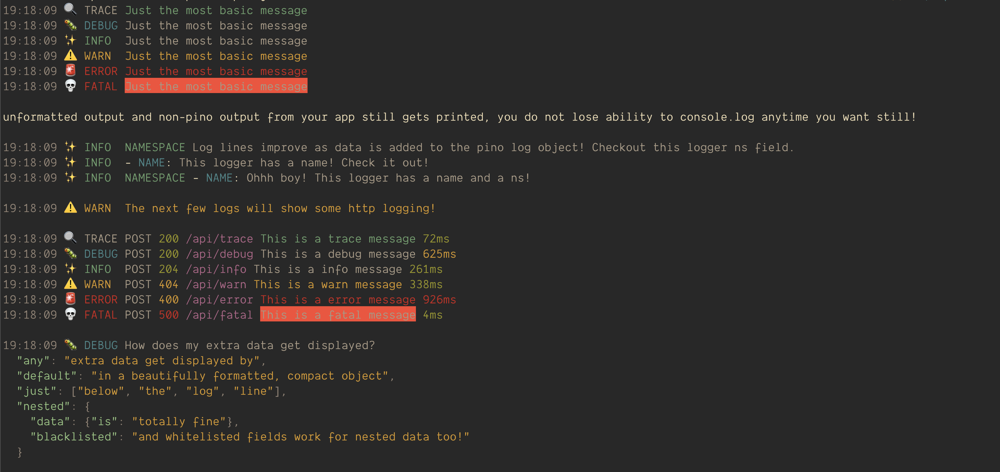
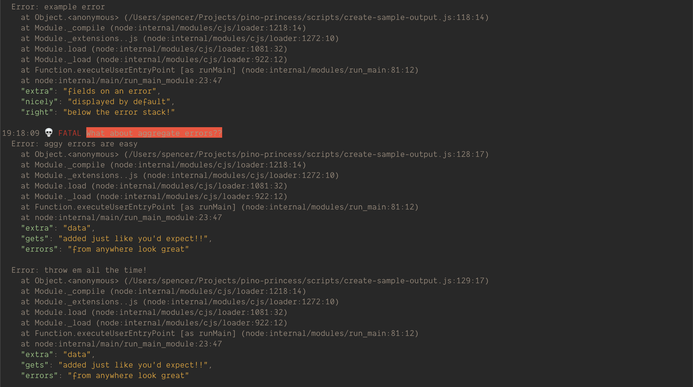

# pino-princess 👸 💅

A pretty dev logger for pino and other ndjson.

Largely inspired from the great pino-colada project but with all the bells and whistles of pino-pretty.

- [pino-princess 👸 💅](#pino-princess--)
  - [Features](#features)
  - [SAMPLES](#samples)
      - [Gruvbox](#gruvbox)
      - [Dracula](#dracula)
  - [Goals](#goals)
    - [Install](#install)
  - [Usage](#usage)
    - [CLI](#cli)
    - [Pino v7 transport](#pino-v7-transport)
  - [Configuration](#configuration)
      - [example](#example)

## Features

- Works _just like_ [pino-pretty](https://github.com/pinojs/pino-pretty)
- Awesome looking log lines out of the box
- All data is displayed with highlighting for _kick-ass_ readability
- ez to customize

## SAMPLES

> note: these samples are created by changing terminal colors - not by changing themes in pino-princess. However, pino-princess themes are entirely configurable so both ways of changing the colors are possible.

#### Gruvbox





#### Dracula


## Goals

[pino-pretty](https://github.com/pinojs/pino-pretty) is hard to configure and I didn't like the defaults. However, it was very good at always showing me all my data. Unfortunately, I didn't care about seeing all the data. For example, most of the time, req/res headers are just noise for me during development.

[pino-colada](https://github.com/lrlna/pino-colada) was an awesome output format, but it was inflexible. I couldn't see all my data when I wanted to because of its rigidity.

In order to get the best of both worlds, I started from a fork of pino-pretty, and developed a configurable, pino-colada like log prettifier that always displays all your data, except when you don't want it to!

You could probably get something pretty similar with just an advanced pino-pretty configuration, but if you prefer lower configuration and easier to understand defaults, choose pino-princess.

### Install

`npm install pino-princess --save-dev`
or
`yarn install -D pino-princess`

## Usage

### CLI

The reccomended usage of pino-princess is as a separate process from your main application which pipes pino logs from stdout into pino-princess for formatting.

`node my-application-which-logs-with-pino.js | npx pino-princess --blacklist "severity" --whitelist "res.headers.ip, res.headers.x-my-important-header"`

### Pino v7 transport

pino-princess, as a fork of pino-pretty, is also set up to be used as a pino v7 transport. Please refer to the pino documentation to set this up.

## Configuration

pino-princess supports a simple configuration which can be supplied as either command line arguments, or alternatively, pino-princess.config.js file located in the path up from where the application is being ran.

These are `blacklist`, `whitelist`, and `formatters`. `blacklist` and `whitelist` are both arrays of strings which represent the dotpath to any field on a deeply nested log object.

#### example

`pino-princess.config.js`

```js
/** @type {import('pino-princess').Configuration}*/
module.exports = {
  /**
   * blacklist
   * string[]
   *
   * An array of strings which represent a key on any object.
   * Keys matching any one of these strings cause these keys to be excluded from the log output.
   * The blacklist is always overridden by the whitelist.
   * In this way, blacklist can be used to exclude large base objects and the whitelist
   * can be used to pick certain fields and "add them back" to the log output.
   * For example, by default, pino-princess blacklists the entire req or res object from any http logger.
   * Because some fields on req and res are required to constuct the core of the log line, these fields are added back via the whitelist.
   *
   * default value:
   */
  blacklist: ["req", "res"],

  /**
   * whitelist
   * string[]
   *
   * An array of strings which represent a key on any object.
   * Keys matching any one of these strings cause these keys will ensure the key is always part of the log output.
   * The whitelist always overrides by the blacklist.
   * In this way, whitelist can be used to "add back" properties of blackListed objects to the log output.
   * By default pino-princess whiteLists all the properties required to create our standard log line.
   *
   * default value:
   */
  whitelist: [
    "res.statusCode",
    "req.method",
    "req.url",
    "level",
    "name",
    "ns",
    "msg",
    "responseTime",
  ],

  /**
   * theme
   * (chalk: Chalk) => string
   *
   * This determines the colors of any extra fields that are not included in the pino-princess log line
   *
   * For convenience an instance of chalk is passed
   *
   * default below
   */
  theme: (chalk) => ({
    /**
     * The color of JSON keys in the log message
     */
    attr: chalk.cyanBright,
    /**
     * The color of strings
     */
    string: chalk.yellow,
    /**
     * The color of numbers
     */
    number: chalk.default,
    /**
     * The color of boolean and null values
     */
    literal: chalk.default
  }),

  /**
   * formatters
   *
   * These are functions which format segments of the pino-princess log-line
   *
   * For the defaults see ./lib/utils/format.ts
   */
  formatters: {
    formatLevel: (level) => {},
    formatLoadTime: (timestamp) => {},
    formatDate: (date) => {},
    formatName: (name) => {},
    formatMessage: (message) => {},
    formatBundleSize:(bundleSize) => {},
    formatNs: (ns) => {},
    formatExtraFields: (extraFields) => {},
    formatStack: (stack) => {},
    formatUrl: (url) => {},
    formatStatusCode: (statusCode) => {},
    formatErrorProp: (err) => {},
    formatMethod: (method) => {},
  }
};
```
