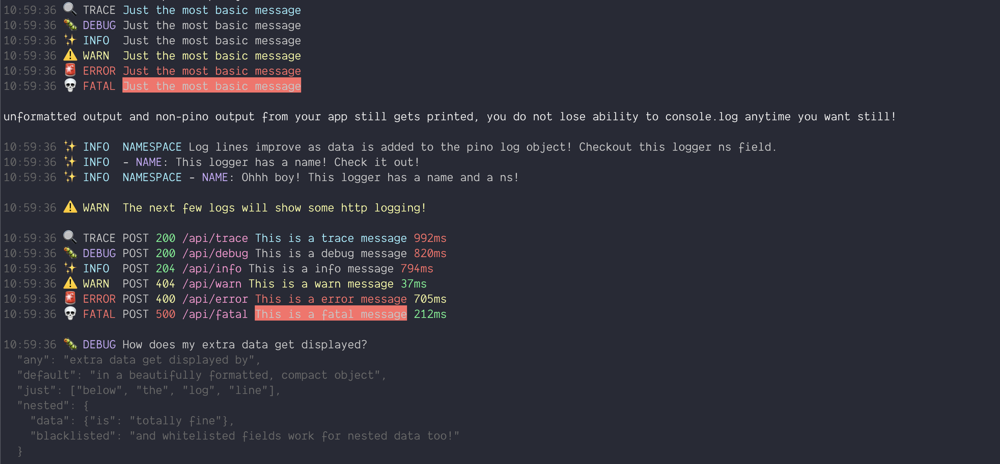
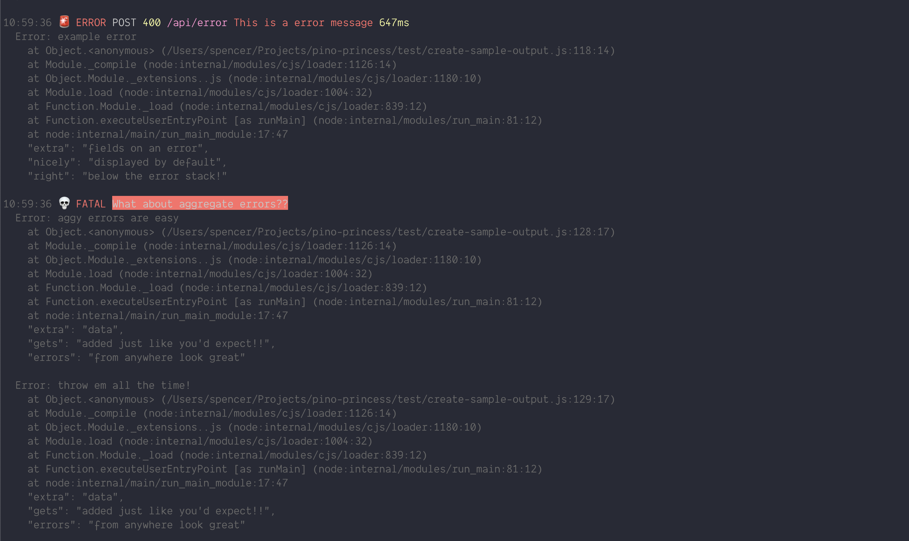

# pino-princess 👸 💅

A pretty and colorful 🌈 dev logger for pino and other ndjson.

Largely inspired from the great pino-colada project but with all the bells and whistles of pino-pretty.

- [pino-princess 👸 💅](#pino-princess--)
  - [Features](#features)
  - [SAMPLES](#samples)
  - [Goals](#goals)
    - [Install](#install)
  - [Usage](#usage)
    - [CLI](#cli)
    - [Pino v7 transport](#pino-v7-transport)
  - [Configuration](#configuration)
    - [example](#example)

## Features

- Works _just like_ [pino-pretty](https://github.com/pinojs/pino-pretty)
- Awesome looking log lines out of the box
- All data is displayed with highlighting for _kick-ass_ readability
- ez to customize

## SAMPLES

> note: these samples are created by changing terminal colors - not by changing themes in pino-princess. However, pino-princess themes are entirely configurable so both ways of changing the colors are possible.





## Goals

[pino-pretty](https://github.com/pinojs/pino-pretty) is hard to configure and I didn't like the defaults. However, it was very good at always showing me all my data. Unfortunately, I didn't care about seeing all the data. For example, most of the time, req/res headers are just noise for me during development.

[pino-colada](https://github.com/lrlna/pino-colada) was an awesome output format, but it was inflexible. I couldn't see all my data when I wanted to because of its rigidity.

In order to get the best of both worlds, I started from a fork of pino-pretty, and developed a configurable, pino-colada like log prettifier that always displays all your data, except when you don't want it to!

You could probably get something pretty similar with just an advanced pino-pretty configuration, but if you prefer lower configuration and easier to understand defaults, choose pino-princess.

### Install

`npm install pino-princess --save-dev`
or
`yarn install -D pino-princess`

## Usage

### CLI

The reccomended usage of pino-princess is as a separate process from your main application which pipes pino logs from stdout into pino-princess for formatting.

**Basic usage:**

```bash
node my-application-which-logs-with-pino.js | npx pino-princess
```

**Available CLI Options:**

| Option         | Short Flag | Type    | Description                                                                           | Default             |
| -------------- | ---------- | ------- | ------------------------------------------------------------------------------------- | ------------------- |
| `--exclude`    | `-e`       | string  | Comma-separated list of log fields to exclude from output. Overridden by `--include`. | `[]`                |
| `--include`    | `-i`       | string  | Comma-separated list of log fields to include in output. Overrides `--exclude`.       | `[]`                |
| `--messageKey` |            | string  | Key name for the message field in your log objects.                                   | `'msg'`             |
| `--errorKey`   |            | string  | Key name for the error field in your log objects.                                     | `'err'`             |
| `--timeKey`    |            | string  | Key name for the time field in your log objects.                                      | `'time'`            |
| `--timeFormat` |            | string  | Time format string passed to [date-fns format](https://date-fns.org/docs/format).     | `'h:mm:ss.SSS aaa'` |
| `--singleLine` |            | boolean | Format the entire log output as a single line with no newlines.                       | `false`             |
| `--unicode`    |            | boolean | Force unicode emoji support on or off. Auto-detected by default.                      | auto-detect         |
| `--no-colors`  |            | boolean | Disable all color output (use `--no-colors` flag).                                    | `true`              |

**Examples:**

```bash
# Exclude specific fields
node app.js | pino-princess --exclude "severity,hostname,pid"

# Include specific nested fields from excluded objects
node app.js | pino-princess --exclude "res,req" --include "res.statusCode,req.method,req.url"

# Custom message and error keys
node app.js | pino-princess --messageKey "message" --errorKey "error"

# Custom time format
node app.js | pino-princess --timeFormat "yyyy-MM-dd HH:mm:ss"

# Single line output
node app.js | pino-princess --singleLine

# Force unicode off for CI environments
node app.js | pino-princess --unicode false

# Disable colors for plain text output
node app.js | pino-princess --no-colors

# Disable colors when piping to a file
node app.js | pino-princess --no-colors > app.log

# Combined options
node app.js | pino-princess -e "hostname,pid" -i "res.headers.x-custom" --timeFormat "HH:mm:ss"
```

### Pino v7 transport

pino-princess, as a fork of pino-pretty, is also set up to be used as a pino v7 transport. Please refer to the pino documentation to set this up.

## Configuration

pino-princess supports a simple configuration which can be supplied as either command line arguments, or alternatively, pino-princess.config.js file located in the path up from where the application is being ran.

### example

`pino-princess.config.js`

````js
/** @type {import('pino-princess').Configuration}*/
module.exports = {
  /**
   * exclude
   * string[]
   *
   * An array of strings which represent a key on any object.
   * Keys matching any one of these strings cause these keys to be excluded from the log output.
   * The excludes are always overridden by the includes.
   * In this way, excludes can be used to exclude large base objects and the "include"
   * can be used to pick certain fields and "add them back" to the log output.
   * For example, by default, pino-princess excludes the entire req or res object from any http logger.
   * Because some fields on req and res are required to constuct the core of the log line, these fields are added back via the include.
   *
   * default value:
   */
  exclude: ["req", "res"],

  /**
   * include
   * string[]
   *
   * An array of strings which represent a key on any object.
   * Keys matching any one of these strings cause these keys will ensure the key is always part of the log output.
   * The includes always overrides by the excludes.
   * In this way, include can be used to "add back" properties of excluded objects to the log output.
   * By default pino-princess includes all the properties required to create our standard log line.
   *
   * default value:
   */
  include: [
    "res.statusCode",
    "req.method",
    "req.url",
    "req.id",
    "level",
    "name",
    "msg",
    "responseTime",
  ],
  /**
   * Configure the message key
   */
  messageKey: "msg",
  /**
   * Configure the error key
   */
  errorKey: "err",
  /**
   * The key to use for the time segment. Defaults to `time`.
   */
  timeKey: "time",
  /**
   * Supply a custom time format. The time format by default is passed directly to date-fns format
   * https://date-fns.org/docs/format
   */
  timeFormat: "h:mm:ss.SSS aaa",
  /**
   * Format the entire log line on a single line with no new lines
   */
  singleLine: false,
  /**
   * unicode
   * boolean
   *
   * Force unicode emoji support on or off. When undefined, unicode support is auto-detected
   * based on your terminal capabilities using the 'is-unicode-supported' package.
   *
   * Set to false for CI/CD environments or terminals with limited unicode support.
   * When false, ASCII alternatives are used (e.g., '!' instead of '⚠️').
   *
   * default: auto-detected
   */
  unicode: true,
  /**
   * colors
   * boolean
   *
   * Enable or disable colored output. When set to false, all color formatting is disabled,
   * producing plain text output. Useful when piping logs to files or in environments
   * without color support.
   *
   * default: auto-detected via chalk's color support detection
   */
  colors: true,
  /**
   * keyMap
   * object
   *
   * Remap the keys of the log line. This is useful when your log structure uses different
   * field names than pino-princess expects. Supports dot notation for nested keys.
   *
   * IMPORTANT: You cannot set both messageKey and keyMap.msg at the same time
   * (or errorKey/keyMap.err, or timeKey/keyMap.time). Choose one approach.
   *
   * Available remappings:
   * - name: Logger name
   * - time: Timestamp field
   * - level: Log level
   * - req.id: Request ID
   * - req.method: HTTP method
   * - req.url: Request URL/path
   * - res.statusCode: Response status code
   * - msg: Log message
   * - err: Error object
   * - responseTime: Response time/duration
   *
   * @example: If your logs use 'request.path' instead of 'req.url':
   * ```
   * keyMap: {
   *   "name": "namespace",
   *   "err": "error",
   *   "req.url": "request.path",
   *   "req.method": "request.httpMethod",
   *   "res.statusCode": "response.status",
   * }
   * ```
   */
  keyMap: {},
  /**
   * theme
   * (chalk: Chalk) => string
   *
   * This determines the colors of any extra fields that are not included in the pino-princess log line
   *
   * For convenience an instance of chalk is passed
   *
   * default below
   */
  theme: (chalk) => ({
    /**
     * The color of JSON keys in the log message
     */
    attr: chalk.cyanBright,
    /**
     * The color of strings
     */
    string: chalk.yellow,
    /**
     * The color of numbers
     */
    number: chalk.default,
    /**
     * The color of boolean and null values
     */
    literal: chalk.default,
  }),
};
````
